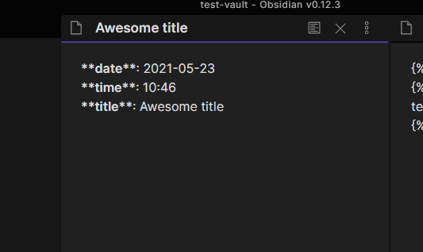

## Liquid Templates

This is a plugin for Obsidian (https://obsidian.md).

With this plugin, you can write your templates using [LiquidJS](https://liquidjs.com/) tags

## Disclaimer

This plugin is still under heavy development, so it's not optimized yet and has basic features. 

## Autocomplete

There is an aucomplete feature that by default is triggered by `;;` but can be customized in the options



## Examples

This means that you can create a template made from smaller ones, for example (assuming that your templates folder is `templates`): 

*templates/header.md*
```
# Header

Insert a common header
```

*templates/footer.md*
```
---
I'm just a footer
```

*templates/awesome_template.md*
```


This is the body of my note: {{title}}
link to today note [[{{date}}]]


```

When you create a note with the "Awesome template" template, you'll end up with:

*A cool title.md*
```
# Header

Insert a common header

This is the body of my note: A cool title
link to today note [[2021-05-21]

---
I'm just a footer
```

But other than that, you can use all the basic [tags](https://liquidjs.com/tags/overview.html) and [filters](https://liquidjs.com/filters/overview.html)

## Custom Filters

For now I'll keep the documentation of the filters here, when they become more I'll move it somewhere more convenient

### `date` filter

The LiquidJS [built-in `date` filter](https://liquidjs.com/filters/date.html) has been replaced with a custom one.
For now, if there is a `%` character in the date format the old filter is used, otherwise the new one will take place.

The new `date` filter uses [date-fns](https://date-fns.org/) as library to handle dates, and the format strings to use are showed here: [date-fns formats](https://date-fns.org/v2.21.3/docs/format)

There are also some special words that can be used with this filter:

| word        | example                                     | effect                                                                                                                                        |
| ----------- | ------------------------------------------- | --------------------------------------------------------------------------------------------------------------------------------------------- |
| "now"       | `{{ "now" &#124; date: "yyyy-MM-dd" }}`       | Use the date from `new Date` and formatted with the given format                                                                              |
| "today"     | `{{ "today" &#124; date: "yyyy-MM-dd" }}`     | same as `now`                                                                                                                                 |
| "yesterday" | `{{ "yesterday" &#124; date: "yyyy-MM-dd" }}` | use the [`subDays`](https://date-fns.org/v2.21.3/docs/subDays) function to subtract `1` from `Date.now()` and formatted with the given format |
| "tomorrow"  | `{{ "tomorrow" &#124; date: "yyyy-MM-dd" }}`  | use the [`addDays`](https://date-fns.org/v2.21.3/docs/addDays) function to add `1` to `Date.now()` and formatted with the given format        |

#### Default format

Now you can use the "Date Format" you defined inside the plugin settings in a easier way:

**Before**: `{{ "now" | date: default_date_format }}`

**Now**: `{{ "now" | date }}` the format you specified in the settings is now used as default

### `days_ago` filter

A simple filter that uses the [`subDays`](https://date-fns.org/v2.21.3/docs/subDays) to subtract days from the current date (`Date.now()`)

Keep in mind that this filter returns a date that needs to be formatted, so needs to be used with the `date` filter, like this:

- `{{ 1 | days_ago | date }}` same as `{{ "yesterday" | date }}`
- `{{ 2 | days_ago | date }}` return the date from two days ago

This can be used for a "Weekly Review" template, something like:

```
- [[{{ 7 | days_ago | date }}]]
- [[{{ 6 | days_ago | date }}]]
- [[{{ 5 | days_ago | date }}]]
- [[{{ 4 | days_ago | date }}]]
- [[{{ 3 | days_ago | date }}]]
- [[{{ 2 | days_ago | date }}]]
- [[{{ 1 | days_ago | date }}]]
```

### `days_after` filter

A simple filter that uses the [`addDays`](https://date-fns.org/v2.21.3/docs/addDays) to add days to the current date (`Date.now()`)

Keep in mind that this filter returns a date that needs to be formatted, so needs to be used with the `date` filter, like this:

- `{{ 1 | days_after | date }}` same as `{{ "tomorrow" | date }}`
- `{{ 2 | days_after | date }}` return the date from two days from now

## Template context

Other than the classic, `date`, `time` and `title` variable you also have:

| Name                | Description                                                                                                                                         |
| ------------------- | --------------------------------------------------------------------------------------------------------------------------------------------------- |
| default_date_format | The date format that you have specified in the plugin settings and can be used like this: <code>{{ "now" &#124; date: default_date_format }}</code> |
| default_time_format | The time format that you have specified in the plugin settings and can be used like this: <code>{{ "now" &#124; date: default_time_format }}</code> |

## Roadmap

For now, this plugin just includes the basic version of LiquidJS, but I want to extend it to allow:

- [ ] Add autocomplete to the template folder, excluded folder settings
- [ ] Implement a fuzzy finder for the autocomplete
- [x] Implement/install a filter that allows you to write `{{ 1 | days_ago | date: default_date_format }}`
- [ ] Parse a selected template string, something like you select `{{ "dQw4w9WgXcQ" | youtube_iframe }}` run a command and end up with the parsed result, in this case, the youtube iframe. (the `youtube_iframe` tag does not exist yet)